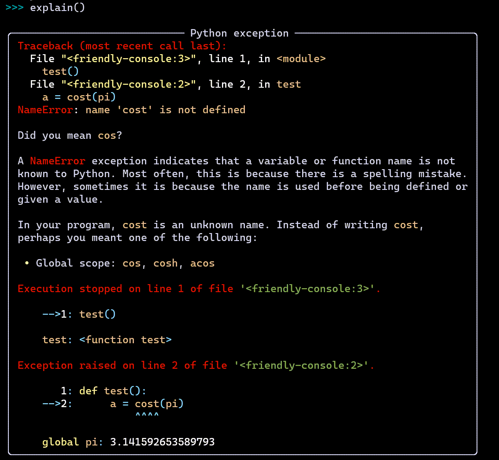

# friendly/friendly-traceback

- **friendly_traceback**: Helps understand Python traceback
- **friendly**: Prettier version of the above with some additional enhancements.

This code repository is for **friendly_traceback**.

Unless specified otherwise, from here on, **Friendly** will refer to both
**friendly** and **friendly_traceback**

## Description

Created with Python beginners in mind, but also useful for experienced users,
**Friendly** replaces standard tracebacks
by something easier to understand, translatable into various languages. 
Currently, the information provided by **Friendly** is only available
in two languages: English and French.

The additional information provided by **Friendly** includes
`why()` a certain exception occurred,
`what()` it means, exactly `where()` it occurred including
the value of relevant variables, and
[more](https://aroberge.github.io/friendly-traceback-docs/docs/html/).



The screenshot above was taken on Windows. In some other operating systems
you might need to type `python3` instead of `python`: **Friendly**
requires Python version 3.6 or newer.

## Installation

```
python -m pip install friendly_traceback
```

Note that most users should install **friendly** instead of **friendly_traceback**,

```
python -m pip install friendly
```

This needs to be done from a terminal.
In the command shown above,
`python` refers to whatever you need to type to invoke your
favourite Python interpreter.
It could be `python`, `python3`, `py -3.8`, etc.


For some special cases, including
using a specialized editor like [Mu](https://codewith.mu) that has its own way
of installing Python packages, please consult the documentation.

## Documentation

[The documentation is available by clicking here.](https://friendly-traceback.github.io/docs/index.html)

## Example

The following example illustrates the information that can
be provided by **Friendly**.

```
    Traceback (most recent call last):
      File "<friendly-console:5>", line 1, in <module>
        test()
      File "<friendly-console:4>", line 2, in test
        a = cost(pi)
    NameError: name 'cost' is not defined

        Did you mean `cos`?

    A `NameError` exception indicates that a variable or
    function name is not known to Python.
    Most often, this is because there is a spelling mistake.
    However, sometimes it is because the name is used
    before being defined or given a value.

    In your program, `cost` is an unknown name.
    Instead of writing `cost`, perhaps you meant one of the following:
    *   Global scope: `cos`, `cosh`, `acos`

    Execution stopped on line 1 of file `'<friendly-console:5>'`.

    -->1: test()

            test: <function test>

    Exception raised on line 2 of file `'<friendly-console:4>'`.

       1: def test():
    -->2:    a = cost(pi)
                 ^^^^

            global pi: 3.141592653589793
```

## Projects using Friendly

friendly/friendly-traceback is used by:

* [HackInScience](https://hackinscience.org)
* [futurecoder](https://futurecoder.io)
* [CodeGrade](https://www.codegrade.com/blog/friendly-better-error-messages-for-python)
* [ddebug](https://github.com/matan-h/ddebug)

Feel free to contact me to add your project to this list.

## Contribute

Contribute by making suggestions for improvements, pointing out mistakes either in
the documentation or in the information provided by **Friendly**, or finding bugs.

If you speak a language other than English or French and feel ambitious, you might
want to work on translations into your own language.

For more details, see [CONTRIBUTING](CONTRIBUTING.md)

## License: MIT

For more details, see [LICENSE](LICENSE).

Some ideas were adopted from
[DidYouMean-Python (aka BetterErrorMessages)](https://github.com/SylvainDe/DidYouMean-Python)
by Sylvain Desodt, a project that is also using the MIT license; as of October 2021, 
that particular project is no longer maintained.

## Code of Conduct

In short: be respectful of everyone.

For more details, see [Code of Conduct](CODE_OF_CONDUCT.md)

## JetBrains support

We graciously acknowledge the support of [JetBrains](
https://www.jetbrains.com/community/opensource/?from=friendly-traceback)
which enables us to use the professional version
of PyCharm for developing **Friendly**.

[](
https://www.jetbrains.com/community/opensource/?from=friendly-traceback)
